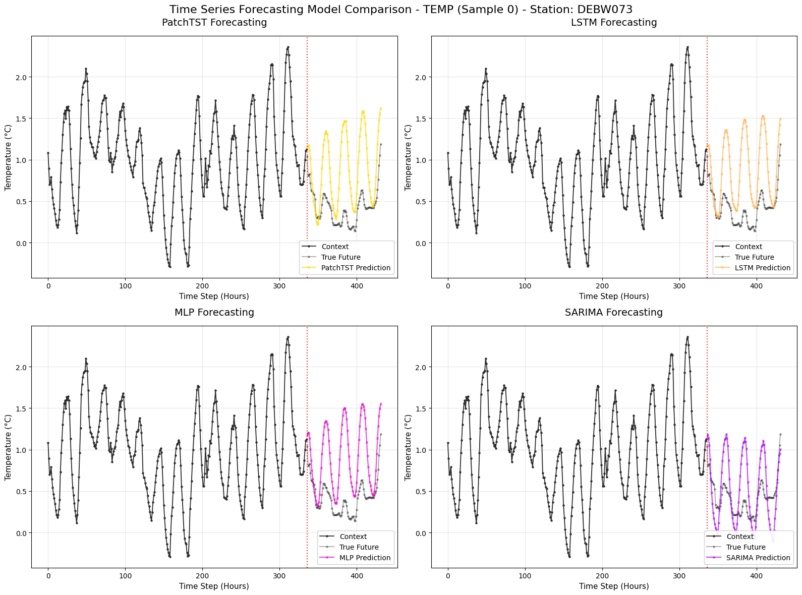
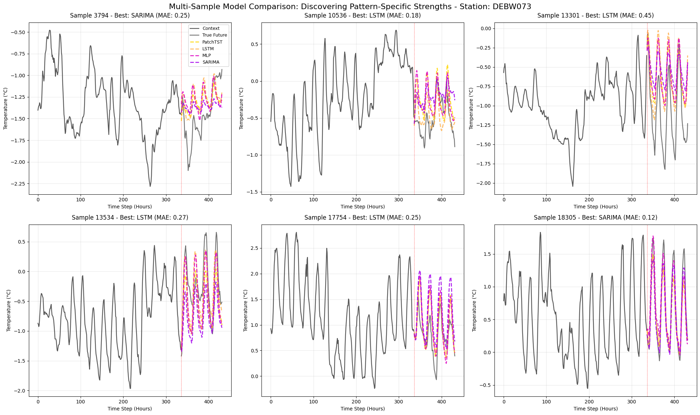
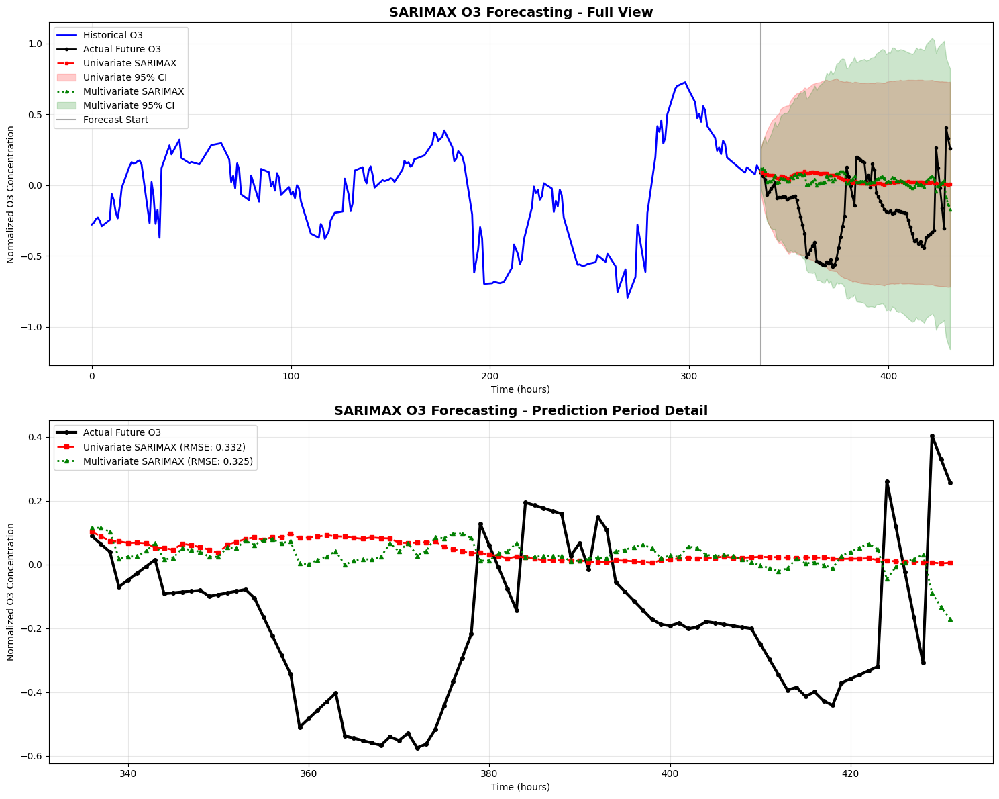
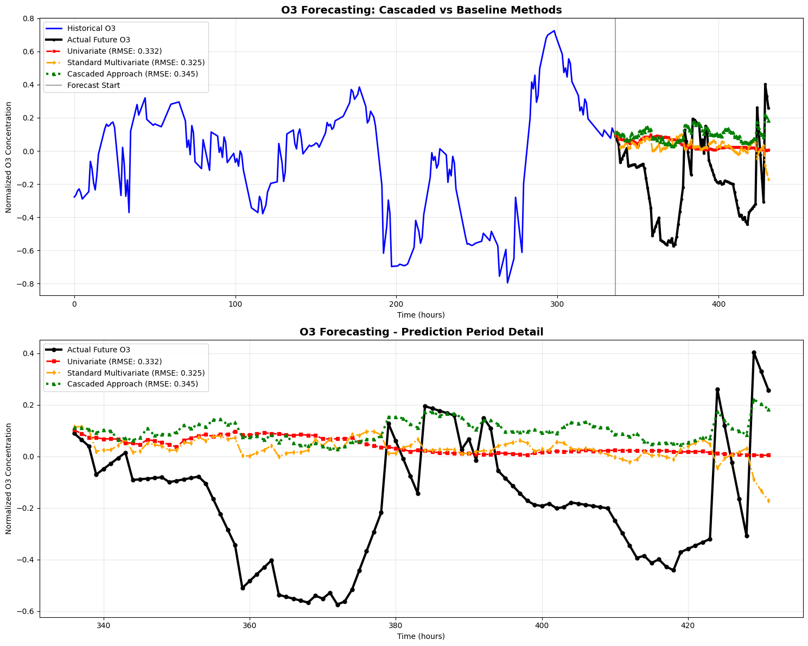

# Homework 2

Task description:
> 1. Extend the code in notebook 7_multi_model_plotting to read the forecast results from all trained models and plot all curves in one panel. Make sure that your code can be re-used if you make forecasts for other stations or time episodes.
> 2. Extend at least one of the models to input multivariate data. Download ozone data from TOAR (use the scripts in notebook 1). Copy the notebook with the model of your choice into a new notebook and extend the code so that temperazure and ozone data are used as inputs. The goal is to forecast ozone concentrations, you don't need to output temperature.
> 3. In reality, you will often have forecasts of weather variables (here temperature) available, so you can use future temperature values to forecast the ozone concentrations. Make another copy of your multivariate notebook and adjust the code accordingly. Use your multi-model plotter to compare the results from tasks 2 and 3.

## Solution:

### 1)

#### A) Preparation

First, working through notebooks 1-6, I solved some tasks and answered questions along the way, adding markdown units in-place. 

For the other notebooks, it was more easy to follow since PyTorch was used, and this is better supported by AMD graphics card using ROCm. I have had a lot of trouble installing tensorflow for the correct version of Python/ROCm, and even after installing everything properly, the kernel crashes for any invocation of a tensorflow function, even when just trying to display the version. This lead to a lot of time lost on an issue that can ultimately not be resolved. Thus, I resorted to running the notebooks via CPU.

I noticed the shape of the data is not the same as in the example notebooks (i.e., my csv had more data points..), but I was able to still properly normalize it and follow all notebooks until number five. The LSTM output was significantly different than that of the notebook uploaded to git, I suspect an error in data handling on my side.

Thus, I decided to download exactly the X_test, X_train, etc. files to match the notebook. Finally, the output of notebook 5 using the downloaded pkl's looked correct; 

I ran into issues trying to launch a local wandb server due to some error with the docker container, so I connected to the wandb web service to track runs.

#### B) Task Solving

Idea: Grab the code from previous notebooks to load trained models via their .pkl files, then use their prediction visualization code & generalize it to arbitrary inputs (i.e., stations codes, time episodes).

I started with the PatchTST model, which uses the raw data in the code to make predictions. However, this will lead to issues when plotting later, as the other models use a normalized (& sequenced) dataset.

For this reason I have re-trained PatchTST with the normalized data, which yields visually the same result as before, but now the same graph across all models can be used.

It turns out that there is some issue between PatchTST using the normalized data csv and the other models using the .pkl data (their ground truth context is different, thus predictions PatchTST <-> others are misaligned/off). For this reason I re-train PatchTST on the .pkl data.

After re-training, I plotted all 4 model predictions in one panel, it is adjusted such that the desired time episode can easily be adjusted in the viz code.

As a result, I compare model performance across different time episodes. At this time I assume my plotting code/notebook is adjustable to different stations; It should also be possible to run inference for different stations and use the trained models as-is.

> I noticed an issue (or is this by design?) with notebook 3, where the .pkl data is prepared. To start, the `create_sequences(...)` method creates sequences for all (3) stations correctly and concatenates results. However, then the train/test split is performed temporally across all stations. This is problematic, and we can easily check this: if querying the pkl for train/test datasets, we find that no test dataset for station "DEBW073" exists, or rather, said station is not part of the global test dataset. The last cells in notebook 3 elaborate on this.

In order to avoid confusion on the construction of train/test datasets, and which were used for what models, I implemented the following in notebook 3:
- X_train_corrected.pkl - contains sequenced priors for all 3 stations based on 80% of per-station data for training
- Y_train_corrected.pkl - contains sequenced posts for all 3 stations based on 20% of per-station data for training

accordingly, X_test_corrected.pkl and Y_test_corrected.pkl are used for testing in a similar fashion.

#### C) Model Comparison

Now that the data is standardized across models, here is how it is being used:
- PatchTST, MLP, LSTM: Trained on all stations
- AR (SARIMAX): Fitted on the pkl's test sequences

First, run inference for all models based on the same timeframe and a fixed station:

While this gives a good first impression, where it may become apparent that "trained" models such as PatchTST, LSTM and MLP respect an upwards trend, while SARIMA as a statistical model does not include "global" information on the possible following period, the question whether similar observations hold across vastly different contexts holds true remains. Therefore, consider the following plots showing all model inferences across different samples fixed by one station:

Across different episodes, we see it depends on the context whether a model's prediction is more accurate than the others. However, generally we can say that LSTM or PatchTST perform best overall, while being often very closely together. With some samples, SARIMA is surprisingly strong and might outperform the others, and this could be due to the fact that SARIMA might ignore some "global" influences, which it simply would not account for, and other models are punished by taking into account overall trends where there are none. 

Evaluating training, it is not very surprising that the LSTM took longest to train (LSTM > PatchTST > MLP), due to the required sequential processing by its recurrent nature, which is especially slow on the CPU. With PatchTST, it might be due to the self-attention mechanism & multiple transformer layers; for the MLP, this could still be performed on the CPU very well.

### 2)

#### A) Idea

To get started, I would be interested to know whether SARIMAX would perform significantly better using multivariate data. My idea is to copy notebook 3 and implement it there. I would use notebook 1 to download ozone data for the three stations I already have temperature data on. Then, run inference in the multivariate case.

#### B) Implementation

Downloading the normalized multivariate data for the three stations from gdrive, I can get started immediately. However, I notice the data does not have the expected format compared to previous univariate variant. This is mainly due to how the data is merged (cannot just run sequence creation).

While this means I cannot just reuse my previous implementation, I can still use similar timeframes for context + future ground truth, but these might contain holes. Therefore, my code also contains a search for good data quality sections of the data, where not as many holes are present for comparison to the univariate case. 

#### C) Results

First, predicting temperature using true future o3 values as an exogenous variable indeed yields the desired improvement by using the multivariate model. In quick tests, the model is often around 20% better at predicting the temperature than using just the temperature:

In reality, it would not be possible to forecast temperature using true future o3 values, but after testing a couple forecasts with lagged/prior o3 values still yields a performance increase, although of course this time smaller than using true future values.
However, the task was to use temperature to predict the ozone concentration;
Running the same model again but "switching columns" (i.e., predicting o3 using temp as exogenous) results in a terribly bad prediction, which is almost a flat horizontal line for both the uni-/multivariate case; at first thought, this is due to the model parameters not chosen appropriate. For example, for temperature assuming 24-hour seasonality is reasonable, but for o3 this might not be appropriate.

To conclude, it does not make a lot of sense to use SARIMAX to predict o3 for several reasons:
- temperature values show often a smooth, transitory process, with predictable daily cycles and linear physical processes underneath
- o3 on the other hand is rather "chaotic", depends on complex photochemistry, non-linear reactions with temperature

I re-plot the model with different orders and seasonalities, but this does not improve the output by much (see notebook `3_AutoRegressive_Models_Multivariate`). Using a different model would only make sense here.

#### Correction

In Retrospective, after finishing the last task, I notice to have used actual future temperature values to forecast the o3 concentration. While this is unrealistic in practice (see task 3), I would argue that exploiting the autoregressive feature of temperature time series data, this difference (using a lagged temperature vs. true future) would not makes as much of a difference in this scenario; even more so, using "perfect" temperature data for the forecast and only achieving a small improvement in the forecast indeed shows that the temperature's influence in the multivariate case on o3 forecasts is negligible when using SARIMAX. Also, by using perfect temperature future data, we establish an "ideal" baseline for comparison in task 3.

### 3)

#### A) Idea

At first, I am unsure whether I understand the task correctly. So my understanding would be: like I mentioned previously using true future or historic o3 data and temperature data as input to the multivariate SARIMAX model, we can get an improved temperature forecast in comparison to the univariate case. So, using this temperature forecast, and historic o3 time series data, we want to compare our new o3 prediction to the one we previously calculated in exercise 2. So I will make a copy of my notebook `3_AutoRegressive_Models_Multivariate`, namely `3_AutoRegressive_Models_Multivariate_Cascaded`, and implement the steps there.

#### B) Findings

As an intermediate result, we see (comparing the RMSE) that the performance has gotten worse, this is mainly due to the fact that previously, in our multivariate forecast, we used actual future temperature values, which might not make a lot of sense in the real world, but for our testing setup is okay. 

In a sense, the findings here are still valid: the standard multivariate case is stronger than the univariate one, mainly because we supply information that is correlated to some degree, and we have actual future data. However, if we predict the future, error occurs. This error then propagates to the new o3 forecast results also. Additionally, there would also be error within the temperature forecast itself; from its inputs, because we could not use true o3 values to forecast temperature as accurate as we did.

For this reason, our multivariate cascaded forecast must be worse than the multivariate forecast with true future data, but we also find it is even worse than the univariate case, which may come as a surprise. On the other hand, due to overall poor performance of SARIMAX when forecasting o3, we cannot say this finding is really significant.

At this point, one could argue other parameters for SARIMAX might yield more performance, but we have seen in task 2 that SARIMAX even with different parameters does not yield a much better performance forecasting o3, which would also apply here. Again, the practical recommendation would be to just choose another model with the ability to capture non-linear processes, which mathematically, for example a single-layer neural network could do; or, of course PatchTST.

#### C) Summary

Because some previous parts were hard to read, regarding what true data was used when and where, here is a quick summary:
- In 2c), I implement the multivariate case to predict temperature as a quick test, using true o3 future values, this forecast is much more accurate. The accuracy is less, but still better than the univariate case when using lagged o3 values, as in practice the true future values are unknown.
- In 3b), I elaborate on the prior quick test, and use the predicted temperature to build the cascaded forecast. Note that here, the predicted temperature was forecasted using true o3 values, which I argue is not as much an issue, we just need to remember that the forecast is slightly "better"